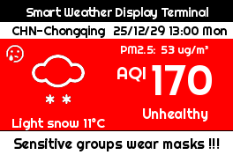

# 🧪 欢迎来到树莓派实验室 / Welcome to the Raspberry Pi Lab

✨ **这是一个充满奇思妙想的创意空间！**
✨ **This is a creative space full of imaginative ideas!**

🚀 本项目中的所有程序都是通过 "vibe coding" 流程开发，旨在快速将灵感变为现实。我们主要使用 **树莓派 3B** 作为核心，并结合各种有趣的传感器和外设来构建和测试各种创意项目。

🚀 All programs in this project are developed through a "vibe coding" process, aiming to quickly turn inspiration into reality. We primarily use the **Raspberry Pi 3B** as the core, combined with various interesting sensors and peripherals to build and test creative projects.

## 📂 趣味项目列表 / Fun Projects

以下是我们正在进行或已完成的项目：
Below is a list of projects we are currently working on or have completed:

### 🍓 **[@SenseHATWebDashboard](./SenseHATWebDashboard/)**

- 🇨🇳 **中文**: 一个基于 Web 的实时仪表盘，用于监控和控制树莓派 Sense HAT 传感器数据，并支持 3D 模型实时同步。
- 🇺🇸 **English**: A web-based real-time dashboard for monitoring and controlling Raspberry Pi Sense HAT sensor data, with support for real-time 3D model synchronization.

  

### 🌈 **[@mcp-weather-ink-suite](./mcp-weather-ink-suite/)**

- 🇨🇳 **中文**: 一个由 AI Agent 驱动的智能墨水屏气象站。通过 MCP 协议连接 PC "大脑" 与树莓派 "手脚"，实时显示全球天气、AQI 及 Gemini 生成的智能建议。
- 🇺🇸 **English**: An AI Agent-powered E-ink weather station. Connects PC "Brain" and Pi "Limbs" via MCP protocol to display real-time global weather, AQI, and Gemini-generated smart advice.

  

  Lahore
  

  Dali
  

  New Delhi
  

---