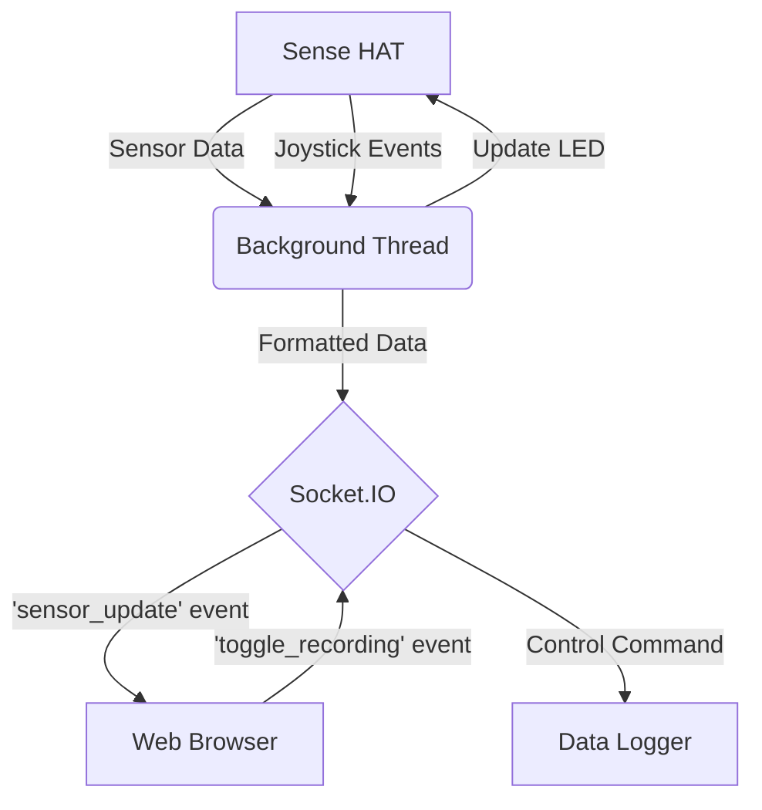
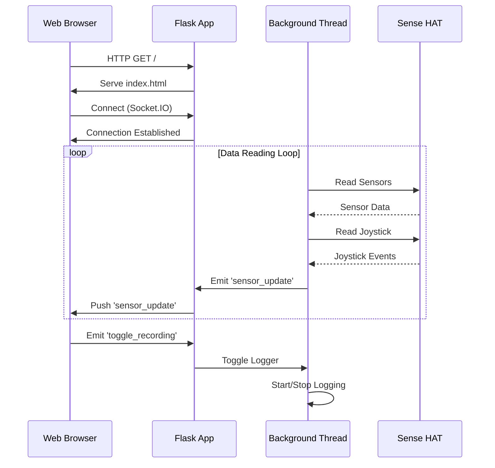

# Sense HAT Web Dashboard

This project provides a web-based dashboard to monitor and interact with a Raspberry Pi Sense HAT in real-time. It streams sensor data to a web interface and allows for controlling the Sense HAT's LED matrix and data logging through a web browser.

## Features

*   **Real-time Sensor Monitoring**: View temperature, humidity, pressure, altitude, and IMU (pitch, roll, yaw) data updated in real-time.
*   **Interactive LED Control**: Change the LED matrix display mode and toggle it on/off using the Sense HAT's joystick.
*   **Web-based Controls**: Start and stop data logging directly from the web interface.
*   **Data Logging**: Record sensor data to a CSV file for later analysis.
*   **Modular Architecture**: The code is organized into distinct modules for hardware interaction, web interface, and core logic.

## Architecture

The application consists of a Python backend and a web-based frontend.

### Backend

The backend is a Flask application that uses Flask-SocketIO for real-time communication with the frontend. It has the following key components:

*   **Web Server (`run.py`)**: Initializes and runs the Flask application.
*   **Background Thread (`src/core/background_thread.py`)**: A dedicated thread that continuously reads data from the Sense HAT, processes it, and emits it to the frontend via SocketIO. It also handles joystick events.
*   **Sense HAT Driver (`src/hardware/sense_driver.py`)**: A wrapper around the official `sense-hat` library to provide a clean interface for accessing sensor data and controlling the LED matrix.
*   **Web Routes (`src/web/routes.py`)**: Defines the HTTP routes for serving the web pages.
*   **SocketIO Handlers (`src/web/socket_handler.py`)**: Manages real-time events between the client and server.
*   **Data Logger (`src/core/logger.py`)**: Logs sensor data to a file when enabled.

### Frontend

The frontend is a single-page web application built with HTML, Bootstrap, and JavaScript.

*   **`web_client/templates/index.html`**: The main and only page of the web application. It uses Socket.IO to receive real-time data from the server and dynamically updates the displayed values.

### Data Flow

#### Flowchart



#### Sequence Diagram



## Getting Started

### Prerequisites

*   Raspberry Pi with a Sense HAT attached.
*   Python 3.
*   `pip` for installing Python packages.

### Installation

1.  **Clone the repository:**
    ```bash
    git clone <repository-url>
    cd SenseHATWebDashboard
    ```

2.  **Install the required Python packages:**
    ```bash
    pip install -r requirements.txt
    ```

### Running the Application

To start the web server, run the following command:

```bash
python run.py
```

The application will be accessible at `http://<your-raspberry-pi-ip>:5000` in your web browser.

## Usage

*   **Web Dashboard**: Open the web interface to see the real-time sensor data.
*   **Data Logging**: Click the "Start Recording" button to begin logging data. The button will turn to "Stop Recording", which you can click to stop. Log files are saved in the `logs` directory.
*   **Joystick Control**:
    *   **Left/Right**: Cycle through the different LED display modes.
    *   **Up/Down**: Adjust the brightness of the LED matrix.
    *   **Middle Button**: Turn the LED matrix on or off.

## Project Structure

```
.
├── .gitignore
├── README.md
├── requirements.txt
├── run.py              # Main application entry point
├── docs/               # Documentation files
├── logs/               # Directory for log files
├── reference/          # Reference materials
└── src/                # Source code
    ├── __init__.py
    ├── config.py       # Configuration settings
    ├── core/           # Core application logic
    │   ├── background_thread.py # Background data reading thread
    │   ├── calculator.py # Calculation utilities (e.g., altitude)
    │   └── logger.py     # Data logging functionality
    ├── hardware/       # Hardware-specific code
    │   ├── display.py    # LED display logic
    │   └── sense_driver.py # Sense HAT hardware wrapper
    └── web/            # Web-related code
        ├── routes.py     # Flask web routes
        └── socket_handler.py # Socket.IO event handlers
└── web_client/         # Frontend files
    ├── static/         # Static assets (CSS, JS, images)
    └── templates/      # HTML templates
        └── index.html
```