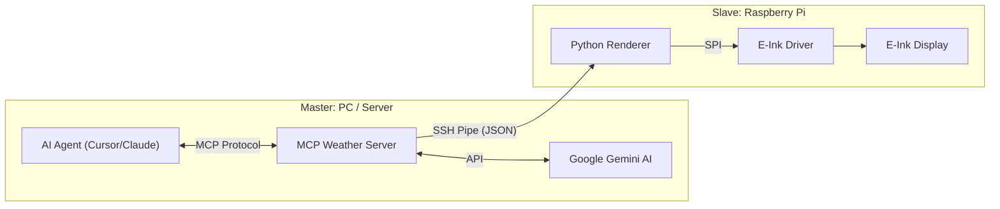
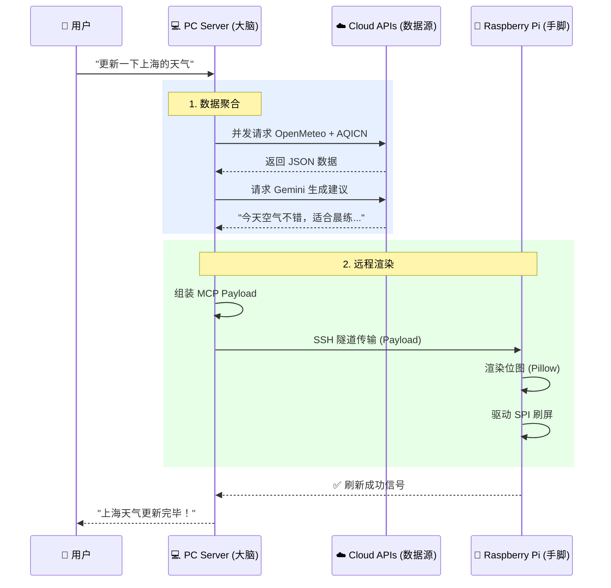
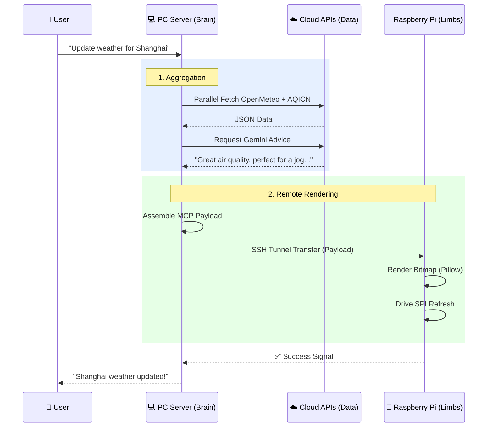

# 🌤️ MCP Weather & Air Info Suite (E-Ink Display System)

<div align="center">

[中文](#cn) | [English](#en)

</div>

<div id="cn"></div>

# 📘 中文文档

## 📖 简介 (Introduction)
**MCP Weather & Air Info Suite** 是一个深度融合了 **Model Context Protocol (MCP)**、**AI Agent** 与 **物联网 (IoT)** 技术的智能硬件显示系统。

它的核心理念是将复杂的**数据处理**与**AI推理**能力保留在性能强大的本地 PC 端（"大脑"），而将嵌入式设备（树莓派）简化为纯粹的**渲染终端**（"手脚"）。您只需通过自然语言（如在 Cursor 或 Claude 中）下达指令，系统即可自动聚合全球天气与空气质量数据，生成贴心的 AI 建议，并毫秒级驱动远程 E-ink 墨水屏刷新。

---

## 🏗️ 系统架构与信号流 (Architecture & Signals)

### 1. 系统分布图 (System Topology)
本系统采用了典型的 **Master-Slave (主从)** 架构，通过 SSH 隧道实现跨设备通信。



### 2. 核心工作流 (Signal Flow)
从用户指令到屏幕亮起的全链路信号流转：



---

## 📺 屏幕显示说明 (Display Info)
墨水屏的 UI 设计追求**极简**与**信息密度**的平衡，主要包含四个区域：

1.  **左上角 (Temperature)**: 当前实时气温，字体硕大，一目了然。
2.  **右上角 (Air Quality)**: 实时 AQI (空气质量指数) 及 PM2.5 浓度，直观展示呼吸安全度。
3.  **中央区 (Weather Icon)**: 基于 QWeather 的动态天气图标（晴、雨、云、雪等），视觉化当前天候。
4.  **底部栏 (AI Advice)**: 由 Google Gemini 为您实时生成的**一句话建议**。
    *   *例如*: "降温了，出门记得带围巾。" 或 "空气优良，去公园散散步吧。"

---

## 🛠️ 技术栈 (Tech Stack)

### Core (核心)
*   **Model Context Protocol (MCP)**: 实现 Agent 与工具的标准连接。
*   **Python 3.10+**: 全栈开发语言。
*   **FastMCP**: 高效构建 MCP Server。

### AI & Data (智能与数据)
*   **Google Gemini**: 多模态大模型，用于生成人性化的天气建议及城市名模糊解析。
*   **Open-Meteo**: 高精度全球天气数据源。
*   **AQICN**: 全球空气质量数据源。

### Hardware & IoT (硬件与物联网)
*   **Raspberry Pi Zero 2W**: 低功耗渲染终端。
*   **Waveshare E-ink Driver**: 墨水屏底层驱动。
*   **SSH / SCP**: 跨设备安全通信与文件传输。
*   **Pillow (PIL)**: 像素级图像处理与位图生成。

---

## 📂 目录结构 (Directory)
```text
mcp-weather-ink-suite/
├── server-pc/       # [大脑] 核心服务 (运行在 Windows/Mac)
│   ├── .env.example # 配置文件模板
│   ├── main.py      # MCP 入口与 SSH 控制逻辑
│   ├── services/    # 聚合、处理、AI 顾问服务
│   └── clients/     # API 客户端 (含 Gemini 纠错)
│
└── client-pi/       # [手脚] 渲染服务 (运行在 Raspberry Pi)
    ├── run_renderer.sh  # 启动脚本
    └── src/
        ├── main.py      # 接收标准输入并在屏幕绘图
        └── epd2in7b.py  # 屏幕驱动
```

---

## 🚀 快速部署 (Deployment)

### 1. PC 端准备 (Server)
1.  **环境**: 确保 Python 3.10+ 及 `uv` 已安装。
2.  **配置**: 
    `cd server-pc` 并 `cp .env.example .env`。
    填入您的 `AQICN_API_KEY`, `GEMINI_API_KEY` 以及树莓派的 `PI_HOST` (IP) 和 `PI_USER`。
3.  **启动**: 在 Claude Desktop 或 Cursor 中加载此目录作为 MCP Server。

### 2. 树莓派准备 (Client)
1.  **传输**: 将 `client-pi` 文件夹完整上传至树莓派用户主目录。
2.  **依赖**: `pip install -r requirements.txt`。
3.  **连接**: 确保 PC 可以通过 `ssh user@ip` 免密连接树莓派（使用 `ssh-copy-id`）。

---

## ❤️ 致谢 (Credits)

本项目得以实现，离不开以下优秀的开源项目与资源：

*   **Core Inspiration**: [weather-mcp-server by Yarflam](https://github.com/Yarflam/weather-mcp-server) - 提供了 MCP 天气服务的基础灵感。
*   **Weather Data**: [Open-Meteo](https://open-meteo.com/) - 免费且无需 Key 的优秀天气 API。
*   **Air Quality Data**: [AQICN](https://aqicn.org/) - 全球空气质量数据平台。
*   **Weather Icons**: [QWeather Icons](https://icons.qweather.com/) / [Github Repo](https://github.com/qwd/Icons) - 精美且开源的天气图标库。
*   **UI Assets**: [Figma Community Resource](https://www.figma.com/files/team/1579151965738435906/resources/community/@MunirSr?fuid=1579151963819758658) - UI 设计资源参考。

---

<div id="en"></div>

# 📘 English Documentation

## 📖 Introduction
**MCP Weather & Air Info Suite** is an intelligent hardware display system integrating **Model Context Protocol (MCP)**, **AI Agents**, and **IoT**.

It follows a philosophy of keeping complex **data processing** and **AI inference** on a powerful local PC (the "Brain"), while simplifying the embedded device (Raspberry Pi) into a pure **rendering terminal** (the "Limbs"). Simply by issuing natural language commands (e.g., in Cursor or Claude), the system automatically aggregates global weather/AQI data, generates smart advice via AI, and instantly refreshes a remote E-ink display over SSH.

---

## 🏗️ Architecture & Signal Flow

### 1. System Topology
Uses a classic **Master-Slave** architecture linked via SSH tunnels.

```mermaid
graph LR
    subgraph "Master: PC / Server"
        Agent[AI Agent (Cursor/Claude)]
        MCP_Server[MCP Weather Server]
        Gemini[Google Gemini AI]
    end

    subgraph "Slave: Raspberry Pi"
        Renderer[Python Renderer]
        Driver[E-Ink Driver]
        Screen[E-Ink Display]
    end

    Agent <-->|MCP Protocol| MCP_Server
    MCP_Server <-->|API| Gemini
    MCP_Server -->|SSH Pipe (JSON)| Renderer
    Renderer -->|SPI| Driver
    Driver --> Screen
```

### 2. Signal Workflow
From user command to screen refresh:



---

## 📺 Display Layout
The E-ink UI is designed for **minimalism** and **readability**:

1.  **Top-Left (Temperature)**: Large font real-time temperature.
2.  **Top-Right (Air Quality)**: Real-time AQI and PM2.5 levels.
3.  **Center (Weather Icon)**: Dynamic QWeather icon (Sun, Rain, Cloud, Snow) visualizing conditions.
4.  **Bottom (AI Advice)**: **One-sentence advice** generated in real-time by Google Gemini.
    *   *Example*: "It's getting cold, bring a scarf." or "AQI is good, enjoy a walk in the park."

---

## 🛠️ Tech Stack

### Core
*   **Model Context Protocol (MCP)**: Standard connection for Agents and Tools.
*   **Python 3.10+**: Full-stack language.
*   **FastMCP**: Rapid MCP Server development.

### AI & Data
*   **Google Gemini**: Multimodal LLM for humanized advice and fuzzy city resolution.
*   **Open-Meteo**: High-precision global weather data.
*   **AQICN**: Air Quality Index data source.

### Hardware & IoT
*   **Raspberry Pi Zero 2W**: Low-power rendering terminal.
*   **Waveshare E-ink Driver**: Hardware driver.
*   **SSH / SCP**: Secure cross-device communication.
*   **Pillow (PIL)**: Pixel-perfect bitmap generation.

---

## 📂 Directory Structure
(See directory tree in the Chinese section above)

---

## 🚀 Quick Deployment

### 1. Server Setup (PC)
1.  **Env**: Python 3.10+ and `uv` installed.
2.  **Config**: `cd server-pc` then `cp .env.example .env`.
    Fill in `AQICN_API_KEY`, `GEMINI_API_KEY`, and Pi's `PI_HOST`/`PI_USER`.
3.  **Start**: Load this directory as an MCP Server in Claude Desktop/Cursor.

### 2. Client Setup (Pi)
1.  **Transfer**: Upload `client-pi` folder to Pi's home directory.
2.  **Deps**: `pip install -r requirements.txt`.
3.  **Connect**: Ensure passwordless SSH (`ssh-copy-id`) from PC to Pi.

---

## ❤️ Credits

This project stands on the shoulders of giants:

*   **Core Inspiration**: [weather-mcp-server by Yarflam](https://github.com/Yarflam/weather-mcp-server)
*   **Weather Data**: [Open-Meteo](https://open-meteo.com/)
*   **Air Quality Data**: [AQICN](https://aqicn.org/)
*   **Weather Icons**: [QWeather Icons](https://icons.qweather.com/) / [Github Repo](https://github.com/qwd/Icons)
*   **UI Assets**: [Figma Community Resource](https://www.figma.com/files/team/1579151965738435906/resources/community/@MunirSr?fuid=1579151963819758658)
