# 🌤️ MCP Weather & Air Info Suite (E-Ink Display System)

<div align="center">

[中文](#cn) | [English](#en)

</div>

<div id="cn"></div>

# 📘 中文文档

## 📖 简介 (Introduction)
**MCP Weather & Air Info Suite** 是一个深度融合了 **Model Context Protocol (MCP)**、**AI Agent** 与 **物联网 (IoT)** 技术的智能硬件显示系统。

它的核心理念是将复杂的**数据处理**与**AI推理**能力保留在性能强大的本地 PC 端（"大脑"），而将嵌入式设备（树莓派）简化为纯粹的**渲染终端**（"手脚"）。您只需通过自然语言（如在 Cursor 或 Claude 中）下达指令，系统即可自动聚合全球天气与空气质量数据，生成贴心的 AI 建议，并毫秒级驱动远程 E-ink 墨水屏刷新。

---

## 🏗️ 系统架构与信号流 (Architecture & Signals)

### 1. 系统分布图 (System Topology)
本系统采用了典型的 **Master-Slave (主从)** 架构，通过 SSH 隧道实现跨设备通信。


### 2. 核心工作流 (Signal Flow)
从用户指令到屏幕亮起的全链路信号流转：

```mermaid
sequenceDiagram
    participant U as 👤 用户
    participant S as 💻 PC Server (大脑)
    participant C as ☁️ Cloud APIs (数据源)
    participant P as 🍓 Raspberry Pi (手脚)

    U->>S: "更新一下上海的天气"
    rect rgb(230, 240, 255)
        Note over S: 1. 数据聚合
        S->>C: 并发请求 OpenMeteo + AQICN
        C-->>S: 返回 JSON 数据
        S->>C: 请求 Gemini 生成建议
        C-->>S: "今天空气不错，适合晨练..."
    end
    
    rect rgb(230, 255, 230)
        Note over S, P: 2. 远程渲染
        S->>S: 组装 MCP Payload
        S->>P: SSH 隧道传输 (Payload)
        P->>P: 渲染位图 (Pillow)
        P->>P: 驱动 SPI 刷屏
    end
    
    P-->>S: ✅ 刷新成功信号
    S-->>U: "上海天气更新完毕！"
```



---

## 📺 屏幕显示说明 (Display Info)
墨水屏的 UI 设计追求**极简**与**信息密度**的平衡，主要包含三个区域：


1.  **左侧区域 (Weather Side)**:
    *   **左上**: 表情符号 (Emoticon)，直观表达空气满意度（如笑脸/哭脸）。
    *   **左中**: 动态天气图标 (Weather Icon)，视觉化当前天候（晴/雨/云等）。
    *   **左下**: 实时气温与天气描述 (Temp & Desc)，例如 "多云 25°C"。
2.  **右侧区域 (Air Side)**:
    *   **右上**: PM2.5 浓度 (ug/m³)。
    *   **右中**: 实时 AQI 指数，超大字体显示。
    *   **右下**: 空气质量等级 (Level)，如 "良" 或 "轻度污染"。
3.  **底部栏 (AI Advice)**: 由 Google Gemini 为您实时生成的**一句话建议**。
    *   *例如*: "降温了，出门记得带围巾。" 或 "空气优良，去公园散散步吧。"

### 🚨 智能变色逻辑 (Adaptive Color System)
系统会根据 **AQI (空气质量指数)** 自动切换屏幕配色，提供醒目的视觉警示：


*   **🟢 正常 (Normal, AQI ≤ 100)**:
    *   **白底黑字**。界面保持清爽，适合日常查看。
*   **🟠 警告 (Warning, 101 ≤ AQI ≤ 200)**:
    *   **白底红标**。AQI 数值与天气图标自动变红，提示空气轻度污染。
*   **🔴 严重 (Alert, AQI > 200)**:
    *   **红底白字**。全屏反色（红色背景），高亮警示严重污染，提醒尽量减少外出。

---

## 🛠️ 技术栈 (Tech Stack)

### Core (核心)
*   **Model Context Protocol (MCP)**: 实现 Agent 与工具的标准连接。
*   **Python 3.10+**: 全栈开发语言。
*   **FastMCP**: 高效构建 MCP Server。

### AI & Data (智能与数据)
*   **Google Gemini**: 多模态大模型，用于生成人性化的天气建议及城市名模糊解析。
*   **Open-Meteo**: 高精度全球天气数据源。
*   **AQICN**: 全球空气质量数据源。

### Hardware & IoT (硬件与物联网)
*   **Raspberry Pi 3B**: 核心渲染终端 (兼容 Zero 2W / 3B+ / 4B 等支持 SPI 的树莓派)。
*   **Waveshare E-ink Driver**: 墨水屏底层驱动。
*   **SSH / SCP**: 跨设备安全通信与文件传输。
*   **Pillow (PIL)**: 像素级图像处理与位图生成。

---

## 📂 目录结构 (Directory)
mcp-weather-ink-suite/
├── server-pc/       # [大脑] 核心服务 (运行在 Windows/Mac)
│   ├── .env.example # 配置文件模板 (需重命名为 .env 并填写 API Key)
│   ├── main.py      # MCP 入口：初始化 FastMCP，定义 Tools，处理 SSH 指令
│   ├── config.py    # 配置管理：加载环境变量，定义路径与常量
│   ├── services/    # 业务逻辑层
│   │   ├── aggregator.py  # 数据聚合：并发请求 OpenMeteo 与 AQICN
│   │   ├── processor.py   # 数据处理：清洗数据，映射天气代码
│   │   └── advisor.py     # AI 顾问：调用 Gemini 生成天气建议
│   ├── clients/     # API 客户端
│   │   ├── open_meteo.py  # OpenMeteo API 封装
│   │   └── aqicn.py       # AQICN API 封装
│   └── utils/       # 工具函数 (日期处理、校验等)
│
└── client-pi/       # [手脚] 渲染服务 (运行在 Raspberry Pi)
    ├── run_renderer.sh  # 启动脚本：接收标准输入并通过管道传递给 Python
    └── src/
        ├── main.py      # 入口程序：解析 JSON，调用绘图逻辑
        ├── epd2in7b.py  # 驱动程序：Waveshare 2.7inch E-Paper (B) 驱动
        ├── config.py    # 客户端配置：定义字体路径、屏幕分辨率
        ├── services/    # 渲染服务
        │   ├── drawing.py   # 绘图逻辑：由 JSON 数据生成位图 (PIL)
        │   └── hardware.py  # 硬件控制：初始化 SPI，执行刷屏
        └── resources/   # 静态资源 (字体、图标、表情包)

---

## 🚀 快速部署 (Deployment)

### 1. PC 端准备 (Server)
1.  **环境**: 确保 Python 3.10+ 及 `uv` 已安装。
2.  **配置**: 
    `cd server-pc` 并 `cp .env.example .env`。
    填入您的 `AQICN_API_KEY`, `GEMINI_API_KEY` 以及树莓派的 `PI_HOST` (IP) 和 `PI_USER`。
3.  **启动**: 在 Claude Desktop 或 Cursor 中加载此目录作为 MCP Server。

### 2. 树莓派准备 (Client)
1.  **传输**: 将 `client-pi` 文件夹完整上传至树莓派用户主目录。
2.  **依赖**: `pip install -r requirements.txt`。
### 3. 连接与 MCP 配置
确保 PC 可以免密连接树莓派：
```bash
ssh-copy-id user@pi_ip
```

在 Claude Desktop 或 Cursor 中配置 `claude_desktop_config.json`:
```json
{
  "mcpServers": {
    "weather-ink": {
      "command": "uv",
      "args": [
        "--directory",
        "D:/path/to/mcp-weather-ink-suite/server-pc",
        "run",
        "main.py"
      ]
    }
  }
}
```

---

## ❤️ 致谢 (Credits)

本项目得以实现，离不开以下优秀的开源项目与资源：

*   **Core Inspiration**: [weather-mcp-server by Yarflam](https://github.com/Yarflam/weather-mcp-server) - 提供了 MCP 天气服务的基础灵感。
*   **Weather Data**: [Open-Meteo](https://open-meteo.com/) - 免费且无需 Key 的优秀天气 API。
*   **Air Quality Data**: [AQICN](https://aqicn.org/) - 全球空气质量数据平台。
*   **Weather Icons**: [QWeather Icons](https://icons.qweather.com/) / [Github Repo](https://github.com/qwd/Icons) - 精美且开源的天气图标库。
*   **UI Assets**: [Figma Community Resource](https://www.figma.com/files/team/1579151965738435906/resources/community/@MunirSr?fuid=1579151963819758658) - UI 设计资源参考。

---

<div id="en"></div>

# 📘 English Documentation

## 📖 Introduction
**MCP Weather & Air Info Suite** is an intelligent hardware display system integrating **Model Context Protocol (MCP)**, **AI Agents**, and **IoT**.

It follows a philosophy of keeping complex **data processing** and **AI inference** on a powerful local PC (the "Brain"), while simplifying the embedded device (Raspberry Pi) into a pure **rendering terminal** (the "Limbs"). Simply by issuing natural language commands (e.g., in Cursor or Claude), the system automatically aggregates global weather/AQI data, generates smart advice via AI, and instantly refreshes a remote E-ink display over SSH.

---

## 🏗️ Architecture & Signal Flow

### 1. System Topology
Uses a classic **Master-Slave** architecture linked via SSH tunnels.


### 2. Signal Workflow
From user command to screen refresh:

```mermaid
sequenceDiagram
    participant U as 👤 User
    participant S as 💻 PC Server (Brain)
    participant C as ☁️ Cloud APIs (Data)
    participant P as 🍓 Raspberry Pi (Limbs)

    U->>S: "Update weather for Shanghai"
    rect rgb(230, 240, 255)
        Note over S: 1. Aggregation
        S->>C: Parallel Fetch OpenMeteo + AQICN
        C-->>S: JSON Data
        S->>C: Request Gemini Advice
        C-->>S: "Great air quality, perfect for a jog..."
    end
    
    rect rgb(230, 255, 230)
        Note over S, P: 2. Remote Rendering
        S->>S: Assemble MCP Payload
        S->>P: SSH Tunnel Transfer (Payload)
        P->>P: Render Bitmap (Pillow)
        P->>P: Drive SPI Refresh
    end
    
    P-->>S: ✅ Success Signal
    S-->>U: "Shanghai weather updated!"
```



---

## 📺 Display Layout
The E-ink UI is designed for **minimalism** and **readability**:


1.  **Left Panel (Weather Side)**:
    *   **Top-Left**: Emoticon (Happy/Sad face) indicating satisfaction with air quality.
    *   **Middle-Left**: Dynamic Weather Icon (Sun/Rain/Cloud).
    *   **Bottom-Left**: Real-time Temperature & Description (e.g., "Cloudy 25°C").
2.  **Right Panel (Air Side)**:
    *   **Top-Right**: PM2.5 Concentration.
    *   **Middle-Right**: Large AQI Value.
    *   **Bottom-Right**: Pollution Level Text (e.g., "Good", "Moderate").
3.  **Bottom Bar (AI Advice)**: **One-sentence advice** generated in real-time by Google Gemini.
    *   *Example*: "It's getting cold, bring a scarf." or "AQI is good, enjoy a walk in the park."

### 🚨 Adaptive Color Logic
The screen automatically changes color schemes based on **AQI Levels** to provide visual alerts:


*   **🟢 Normal (AQI ≤ 100)**:
    *   **White Background / Black Text**. Clean interface for good air quality.
*   **🟠 Warning (101 ≤ AQI ≤ 200)**:
    *   **White Background / Red Highlights**. AQI value and icons turn **RED** to indicate moderate pollution.
*   **🔴 Alert (AQI > 200)**:
    *   **Red Background / White Text**. Full screen turns red with white text, strongly warning against hazardous conditions.

---

## 🛠️ Tech Stack

### Core
*   **Model Context Protocol (MCP)**: Standard connection for Agents and Tools.
*   **Python 3.10+**: Full-stack language.
*   **FastMCP**: Rapid MCP Server development.

### AI & Data
*   **Google Gemini**: Multimodal LLM for humanized advice and fuzzy city resolution.
*   **Open-Meteo**: High-precision global weather data.
*   **AQICN**: Air Quality Index data source.

### Hardware & IoT
*   **Raspberry Pi 3B**: Rendering terminal (Compatible with Zero 2W / 3B+ / 4B).
*   **Waveshare E-ink Driver**: Hardware driver.
*   **SSH / SCP**: Secure cross-device communication.
*   **Pillow (PIL)**: Pixel-perfect bitmap generation.

---

## 📂 Directory Structure
(See directory tree in the Chinese section above)

---

## 🚀 Quick Deployment

### 1. Server Setup (PC)
1.  **Env**: Python 3.10+ and `uv` installed.
2.  **Config**: `cd server-pc` then `cp .env.example .env`.
    Fill in `AQICN_API_KEY`, `GEMINI_API_KEY`, and Pi's `PI_HOST`/`PI_USER`.
3.  **Start**: Load this directory as an MCP Server in Claude Desktop/Cursor.

### 2. Client Setup (Pi)
1.  **Transfer**: Upload `client-pi` folder to Pi's home directory.
2.  **Deps**: `pip install -r requirements.txt`.
3.  **Connection**: Ensure passwordless SSH access:
    ```bash
    ssh-copy-id user@pi_ip
    ```
4.  **MCP Config**: Add to `claude_desktop_config.json`:
    ```json
    {
      "mcpServers": {
        "weather-ink": {
          "command": "uv",
          "args": [
            "--directory",
            "/path/to/mcp-weather-ink-suite/server-pc",
            "run",
            "main.py"
          ]
        }
      }
    }
    ```

---

## ❤️ Credits

This project stands on the shoulders of giants:

*   **Core Inspiration**: [weather-mcp-server by Yarflam](https://github.com/Yarflam/weather-mcp-server)
*   **Weather Data**: [Open-Meteo](https://open-meteo.com/)
*   **Air Quality Data**: [AQICN](https://aqicn.org/)
*   **Weather Icons**: [QWeather Icons](https://icons.qweather.com/) / [Github Repo](https://github.com/qwd/Icons)
*   **UI Assets**: [Figma Community Resource](https://www.figma.com/files/team/1579151965738435906/resources/community/@MunirSr?fuid=1579151963819758658)
